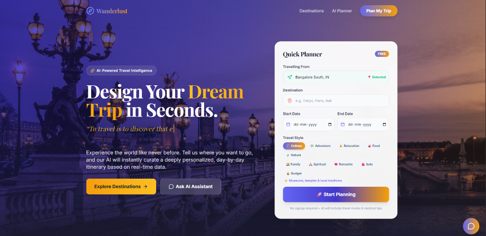
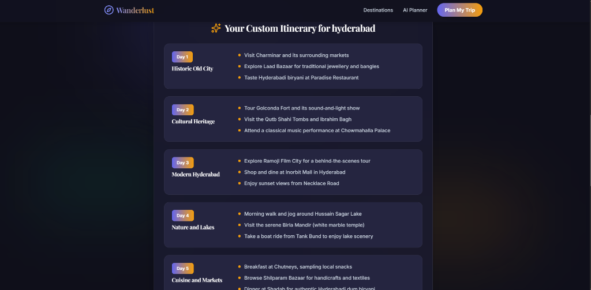
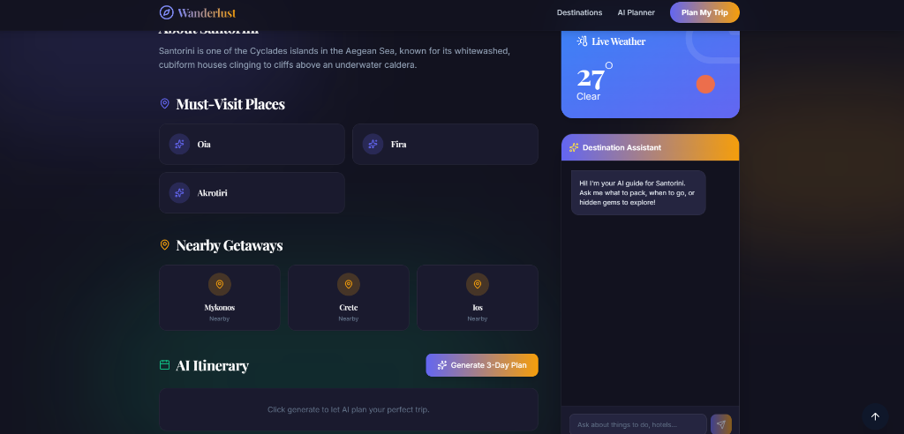
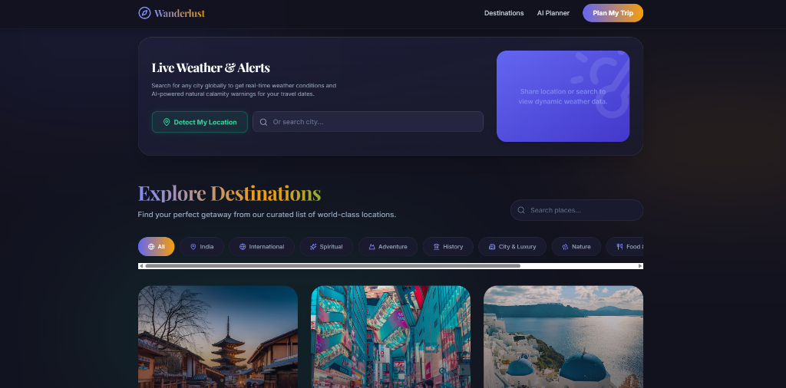
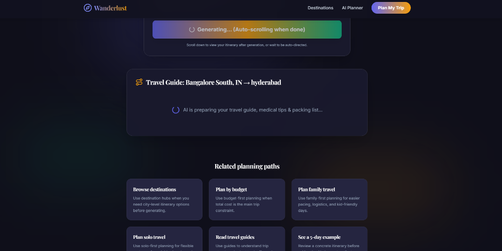

# 🌍 Wanderlust - AI-Powered Travel Planner


### 🚀 **Live Demo:** [travel-app-orpin-nine.vercel.app](https://travel-app-orpin-nine.vercel.app/)

## 📖 Overview
**Wanderlust** is a modern, premium AI-powered travel planning application. It removes the stress of trip planning by instantly generating highly personalized, day-by-day itineraries based on a user's destination, budget, and travel style. It features a sleek dark-themed UI, live weather updates, geolocation support, and integrated AI assistants to answer any travel-related queries.

---

## 📸 Screenshots

| Home Page & Quick Planner | AI Generated Itinerary |
| :---: | :---: |
|  |  |

| Destination Details & Chatbot | Live Weather Widget & Explore |
| :---: | :---: |
|  |  |

| AI Planner Loading State |
| :---: |
|  |

---

## ✨ Features Completed

*   **🤖 AI Itinerary Generation:** Users input their origin, destination, dates, budget, and travel style to receive a comprehensive travel guide.
*   **🚆 Intelligent Route Planning:** AI recommends the best ways to travel (Flights, Trains, Buses) complete with estimated costs in INR.
*   **🏥 Medical & Safety Warnings:** Built-in travel advisory highlighting essential medical items, altitude warnings, and packing checklists.
*   **🌤️ Live Weather & Geolocation:** A dynamic weather widget that auto-detects the user's location via browser GPS and fetches real-time data using the OpenWeather API.
*   **💬 Dual AI Assistants:** 
    *   *Global Chatbot:* A floating assistant on the home page for general travel queries.
    *   *Destination Assistant:* A dedicated chatbot on individual destination pages to ask specific questions about hotels, food, and culture.
*   **🎨 Premium UI/UX:** Built with Tailwind CSS and Framer Motion, featuring a dark glassmorphic design, ambient animated gradients, and smooth page transitions.
*   **🔍 Destination Explorer:** A rich catalog of domestic and international destinations with category filtering (Adventure, Spiritual, Romantic, etc.).

---

## 🚀 How to Run the Project Locally

Follow these steps to set up the project on your local machine.

### Prerequisites
*   Node.js (v16 or higher)
*   npm or yarn

### 1. Clone the Repository
```bash
git clone https://github.com/ArigalaPunithKumar/Travel-Application.git
cd Travel-Application
```

### 2. Install Dependencies
```bash
npm install
```

### 3. Set Up Environment Variables
Create a `.env` file in the root directory (alongside `package.json`) and add your API keys:

```env
# Get this from https://openweathermap.org/api
VITE_OPENWEATHER_API_KEY=your_openweather_api_key_here

# Get this from https://openrouter.ai/
VITE_OPENROUTER_API_KEY=your_openrouter_api_key_here
```

### 4. Start the Development Server
```bash
npm run dev
```

### 5. Open the App
Open your browser and navigate to `http://localhost:5173` to see the app running!

---

## 🛠️ Tech Stack
*   **Frontend:** React (Vite), React Router
*   **Styling:** Tailwind CSS
*   **Animations:** Framer Motion
*   **Icons:** Lucide React
*   **APIs:** OpenRouter AI (Nemotron 30b), OpenWeather API
